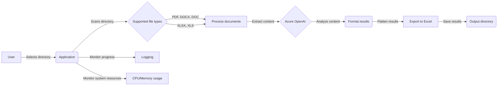
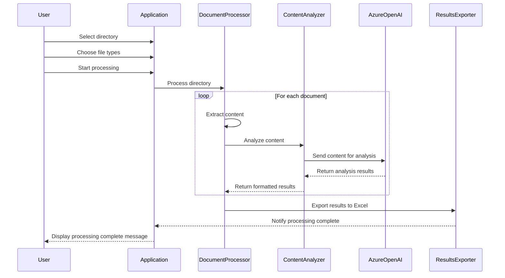

# Document Processor with Azure OpenAI Integration

This project is a Python-based document processor application that leverages Azure OpenAI for extracting and analyzing content from various document formats such as PDF, Word (DOCX, DOC), and Excel (XLSX, XLS). The application provides a user-friendly graphical interface built with tkinter, allowing users to select a directory containing the documents they wish to process. The processed results are then exported to an Excel file for further analysis.

## Features

- Supports multiple document formats: PDF, DOCX, DOC, XLSX, XLS
- Utilizes Azure OpenAI for content extraction and analysis
- Extracts and analyzes contract details, vendor assessments, and technical specifications
- Graphical user interface for easy directory selection and file type filtering
- Progress monitoring and logging for processing status and system resource usage
- Exports processed results to an Excel file with separate sheets for each analysis type
- Handles large document batches with configurable batch size and multi-threading

## Prerequisites

- Python 3.7 or higher
- Azure OpenAI API credentials (endpoint, deployment, and API key)
- Required Python packages (see `requirements.txt`)

## Installation

1. Clone the repository:
   ```
   git clone https://github.com/backymacky/contracts-processor-with-OpenAI.git
   ```

2. Install the required Python packages:
   ```
   pip install -r requirements.txt
   ```

3. Set up your Azure OpenAI API credentials as environment variables:
   ```
   export AZURE_ENDPOINT="your_azure_endpoint"
   export AZURE_DEPLOYMENT="your_azure_deployment"
   export AZURE_API_KEY="your_azure_api_key"
   ```

## Usage

1. Run the application:
   ```
   python contract-processor.py
   ```

2. Select the directory containing the documents you wish to process using the "Browse" button.

3. Choose the file types you want to process by checking the corresponding checkboxes.

4. Click the "Start Processing" button to begin processing the documents.

5. Monitor the progress and logs in the application window.

6. Once processing is complete, the results will be exported to an Excel file in the `output` directory.

## Configuration

You can modify the following configuration parameters in the `ProcessingConfig` class:

- `MAX_WORKERS`: Maximum number of worker threads for concurrent processing (default: number of CPU cores)
- `BATCH_SIZE`: Number of documents to process in each batch (default: 10)  
- `OUTPUT_DIR`: Directory where the processed results will be exported (default: `output`)
- `LOG_LEVEL`: Logging level for the application (default: `DEBUG`)

## Data Flow

1. User selects a directory containing the documents to process.
2. The application scans the directory for supported file types (PDF, DOCX, DOC, XLSX, XLS).
3. Documents are processed in batches using multi-threading. 
4. For each document, the content is extracted based on the file type.
5. The extracted content is sent to Azure OpenAI for analysis (contract details, vendor assessment, technical specifications).
6. The analysis results are formatted and flattened into a structured format.
7. The flattened results are appended to an Excel file, with separate sheets for each analysis type.
8. Progress and system resource usage are monitored and logged throughout the processing. 
9. Once all documents have been processed, the application notifies the user and saves the Excel file in the `output` directory.

## Diagram



## Sequence Diagram


## Contributing

Pull requests are welcome. For major changes, please open an issue first to discuss what you would like to change.

## License

[MIT](https://choosealicense.com/licenses/mit/)
